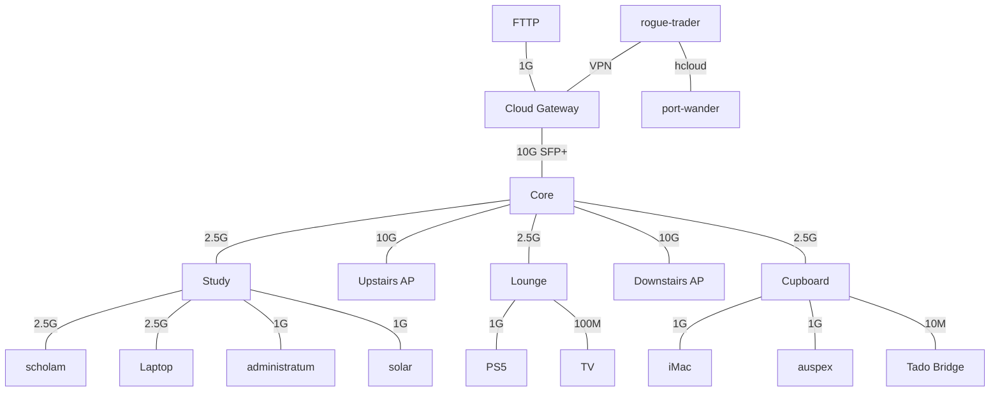

# Lex Imperialis

As it is written in the Lex Imperialis, so shall it be deployed.

## Founding of the Imperium

I have had infrastructure as code for my home fleet spanning back to my early post-graduate days, when it was bash and badly written notes.

Over the years, this repository has existed in many disjointed, fragmented guises: bash, Terraform, Puppet, k3s, simple docker-compose. But there's only been one constant throughout: Ansible. It's long in the tooth, and grey in the hair, but I've been orchestrating my machines with Ansible for well over 10 years now, and I plan to continue until it's EoL (or I am).

### The Claude Chapter

With the advent of Claude, I've been able to unify my various repositories into one mono-repo, and address a lot of the long-standing issues that have been sitting on my `ansible.txt` for longer than I care to remember.

This has a side effect I never considered before I began: a repo that describes the whole fleet is also the context Claude needs to work on it. Launched from inside it, Claude can deploy, debug and drive the stack, with the vault to hand.

## The Fleet

- `scholam` — Beelink Mini S13 — Development box
- `solar` — Beelink Mini S13 — Media server
- `administratum` — Synology DS423+ NAS
  - `scriptorum` — 14 TiB usable SHR1 HDD array
  - `astropath` — 348 GiB usable RAID1 NVMe array
- `auspex` — Raspberry Pi 5 — Monitoring host
- `rogue-trader` — Hetzner VPS — WordPress host
- `port-wander` — 1 TB Hetzner Storage Box — Off-site backup

### The Retinue

- `arbites` — GitOps reconciliation agent
- `inquisition` — Container state drift agent
- `proclamator` — Discord alerting bot
- `lexographer` — Renovate go.sum autofix bot

## The Stack

Tumbleweed on the Beelinks, MicroOS on the VPS, DSM on the NAS, Raspberry Pi OS on the Pi — whose fan needs an RP1 PWM driver openSUSE's aarch64 kernel lacks. Workloads are rootful podman quadlets.

Backends publish no host port at all: they sit on caddy's network and drop a snippet into `/etc/caddy/sites/`. A DNS-01 wildcard issues their certs, so an internal service gets TLS without ever facing the internet. plex is the exception — host-networked, and reached directly. Container state is a named volume, never a host bind mount.

`solar` runs the media stack — prowlarr, sonarr, radarr, lidarr, beets, recyclarr, plex, transmission — with media over NFSv4 from the NAS. All but beets, plex and recyclarr are netns-confined to the wireguard container: the tunnel drops and their network drops with it.

`rogue-trader` serves the public WordPress site behind the same caddy role and joins the fleet over WireGuard, which carries both its scrape and its backup. Its root is read-only: packages come from the `packer/` image, not its play.

`auspex` runs Prometheus to scrape the fleet, blackbox_exporter probes the public sites, and Alertmanager sends what fires. Grafana runs on `solar`, pointed at `auspex`. node_exporter runs on every host but the NAS, and cadvisor on the workload hosts. Liveness is a blackbox probe over the network; a container's own healthcheck exists only to restart it when stuck, and anything that must not be killed mid-flight carries none at all.

Updates run unattended and staggered: `solar` Monday as the canary, `auspex` Tuesday, the VPS midweek, `scholam` last, so one bad update cannot brick the fleet in a single night. One timer per host, with the distribution's own update timers masked, and every run writes its outcome as a metric so a silent failure alerts.

## Network

## Layout

- `roles/` — where the work is. Each ships a README covering its variables and contracts.
- `playbooks/` — one play per host, and the play is that host's spec: its `roles:` and `vars:` are the whole story. `site.yml` is the fleet in one run.
- `inventory/` — `hosts.yml` declares the fleet; `group_vars/all/` holds the shared vars and the vault.
- `terraform/` — OpenTofu for the cloud edge: Cloudflare zones, the Hetzner firewall, the GCP projects behind the site and keyless CI. State in GCS, applied on merge.
- `jonnyoc-site/` — Hugo source for the personal site, built and deployed to Firebase Hosting by CI.
- `packer/` — a two-stage build for an openSUSE MicroOS image for the VPS, since Hetzner ships none.

## Running plays

`make check PLAY=<host>` dry-runs a host (`--check --diff`); `make apply PLAY=<host>` is the real thing. `PLAY=site` is the fleet in one run, `scholam` last so a run never restarts its own timer mid-apply. Both decrypt the vault from `.vault_pass`; tasks that render secrets set `no_log`, so `--diff` stays clean. Check mode is best-effort — an unguarded `command` is skipped, not run, so a dry run under-reports what an apply would change.

The standing exception is `arbites`: a root timer on `scholam` that pulls `origin/main` every 15 minutes and, when it has advanced, applies `site.yml` — so a merged change reaches the fleet with no manual apply. `touch /var/lib/arbites/pause` holds it; `systemctl disable --now arbites.timer` stops it.

## Testing

Molecule, three tiers — two free, one billed:

- `default` — incus container on Tumbleweed. `make test ROLE=<role>`
- `libvirt` — full-boot VM, where a container can't exercise the role. `make test-vm ROLE=<role>`
- `hetzner` — the VM tier's CI form on a real Hetzner VM, since Hetzner cannot nest KVM. `make test-hetzner ROLE=<role>`

Every role ships a container or VM scenario — a VM scenario implies a Hetzner one — and a pre-commit hook fails the commit if it does not. A tier's shared create, destroy and provisioner config lives in `molecule/<tier>/` and merges under the scenario, so a scenario file is its platform plus any override. A scenario's second converge must report zero changed.

## CI

GitHub Actions workflows:

- `lint` — the pre-commit set on every PR and every push to `main`, plus a gitleaks scan of the checked-out commit.
- `molecule` — the role tests. A discover job diffs the PR: a changed role runs whichever tiers it ships along with any role that consumes it through `include_role`, a change outside `roles/` is exercised through the `motd` harness, and a docs-only change runs nothing.
- `terraform` — `tofu plan` on a PR, applied to live cloud infrastructure on merge.
- `firebase` — the Hugo site: a preview channel per PR, the live channel on merge.

Actions are pinned by commit SHA. No workflow holds a vault password: the Hetzner and Cloudflare tokens CI needs are secrets of their own, so the in-repo vault stays operator-only. GCP, and the terraform state bucket, authenticate keylessly through Workload Identity Federation.

## Secrets

Everything lives in one `ansible-vault` file, `inventory/group_vars/all/vault.yml` — encrypted whole, one vault id, no inline `!vault` strings. Vault variables are scoped by host and purpose, and mapped onto a role's generic variable in the play's `vars:`; one named identically to a role's default is picked up from `group_vars/all` with no wiring at all.

OpenTofu cannot read a vault, so its provider tokens are sourced through `bin/vault-var.sh` into `TF_VAR_` at run time.

On a host, a secret is rendered into a 0600 `EnvironmentFile` that the quadlet references rather than into the world-readable unit, and the task that writes it sets `no_log`.

## Bootstrap and recovery

Three one-shot entry points in `bootstrap/` — idempotent, apart from `rogue-trader.yml`'s rebuild path, which re-images the disk every run:

- `host.sh` — run as root on a fresh Tumbleweed install, before the host joins the inventory. Installs sshd and the key-only `ansible` account `scholam` connects as; everything past "Ansible can log in and escalate" belongs to the `common` role.
- `incus.yml` — sets up the molecule runner, the one host molecule cannot provision for itself.
- `rogue-trader.yml` — creates the Hetzner VM from the MicroOS snapshot `packer/` builds, or re-images the existing one in place; Ignition gives it the `ansible` account at first boot, and its play does the rest.

Recovery walks the same path: re-bootstrap the host, run its play to rebuild everything declarative, then restore its podman volumes from the restic repository on the NAS. `docs/disaster-recovery.md` covers it host by host, along with what the backup does and does not hold; `docs/backups.md` is the backup architecture in full.

## Working with Claude

`CLAUDE.md` and `roles/CLAUDE.md` are the house style: quadlets, named volumes, the caddy snippet contract, health probes, commit and branch conventions. Together they are what keeps a generated role indistinguishable from a hand-written one.

Authoring runs through the skills in `.claude/skills/`, each handing to the next:

- `ansible-author` — drafts the role against the `ansible` MCP server and the Red Hat good practices.
- `refine` — design review, then a simplify and code-review loop, then lint and molecule, then the docs.
- `branch-finaliser` — curates the branch into clean, bisect-safe commits and opens the PR.
- `unattended-author` — chains all three and carries them through to a merge gated on a real apply.

## Licence

GPL-3.0. See `LICENSE`.
