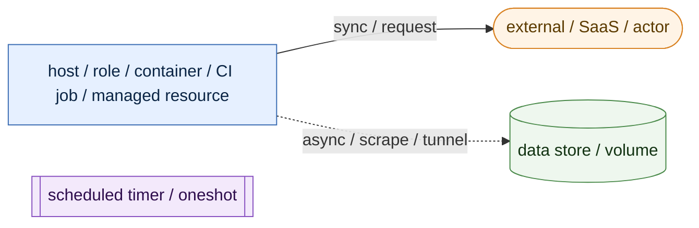
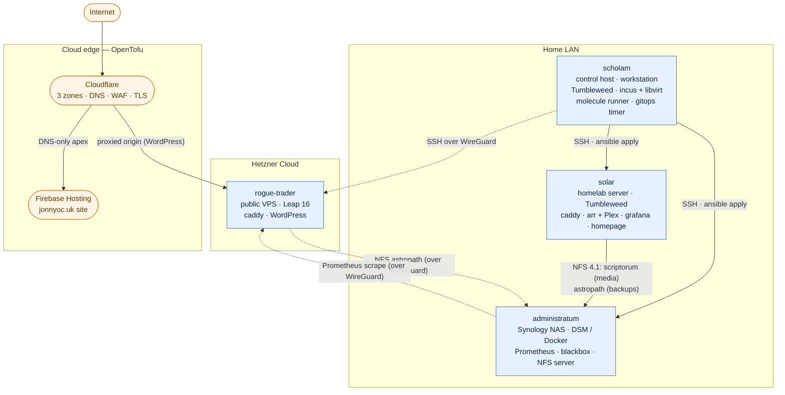
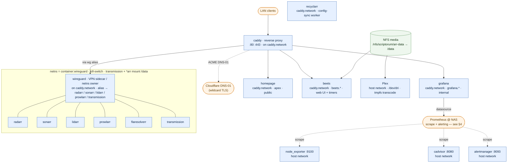
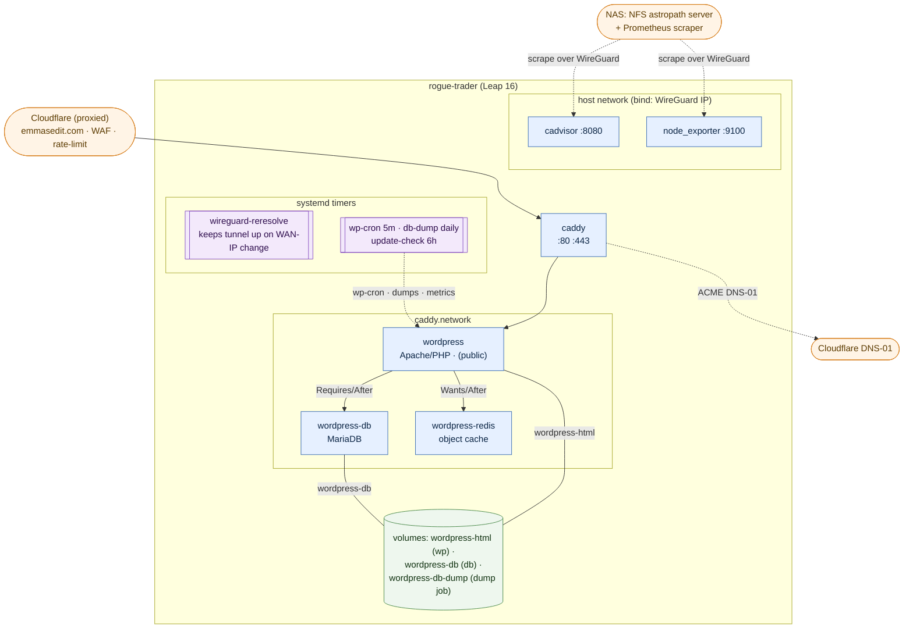
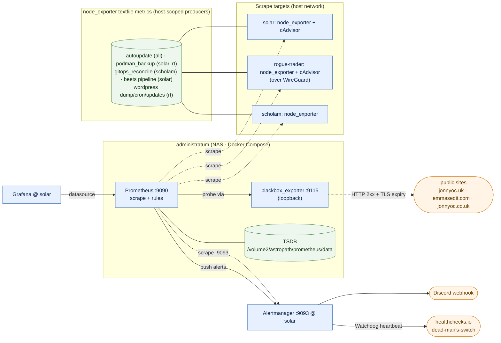
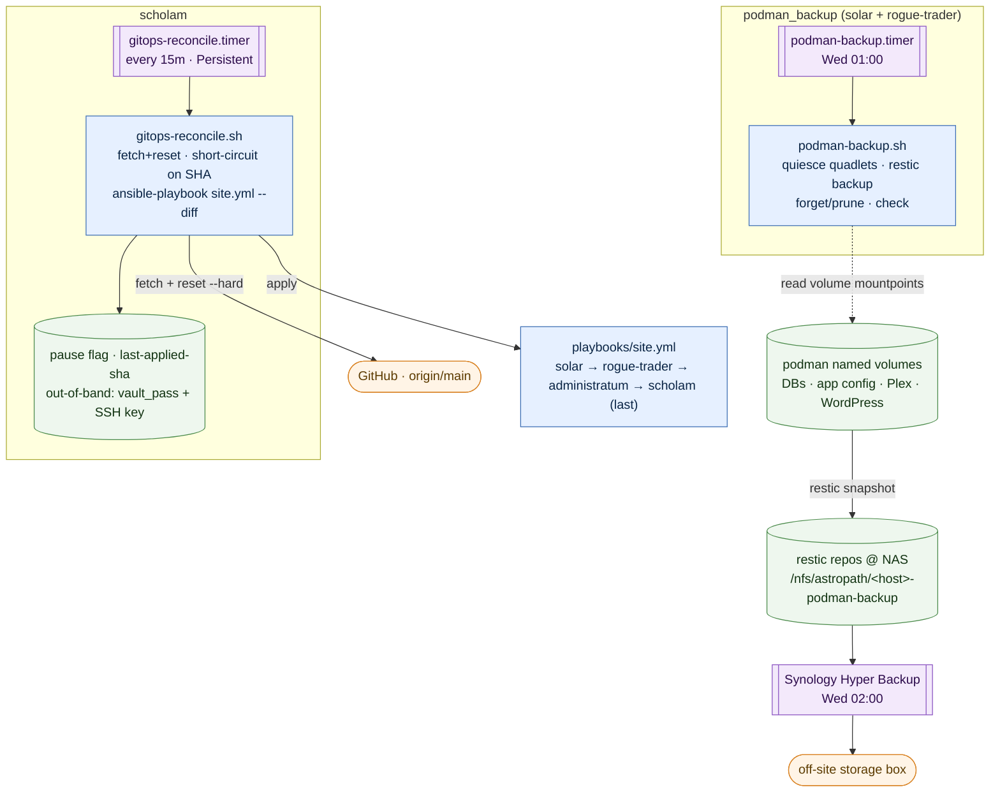
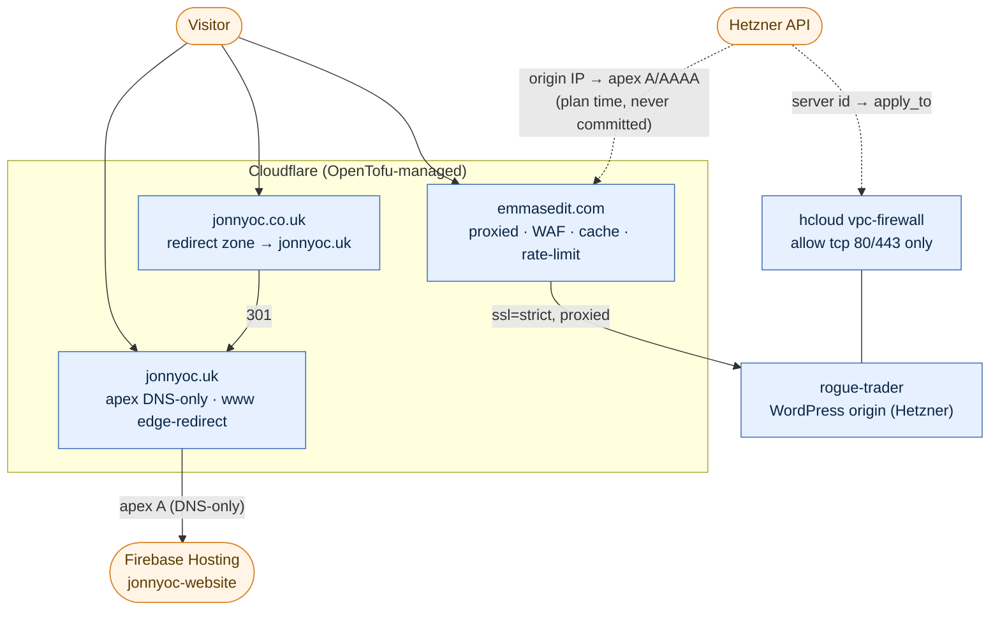
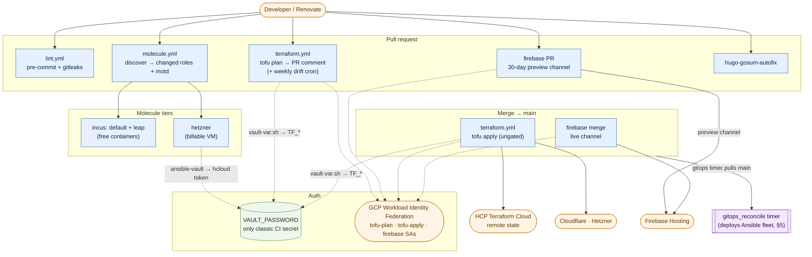
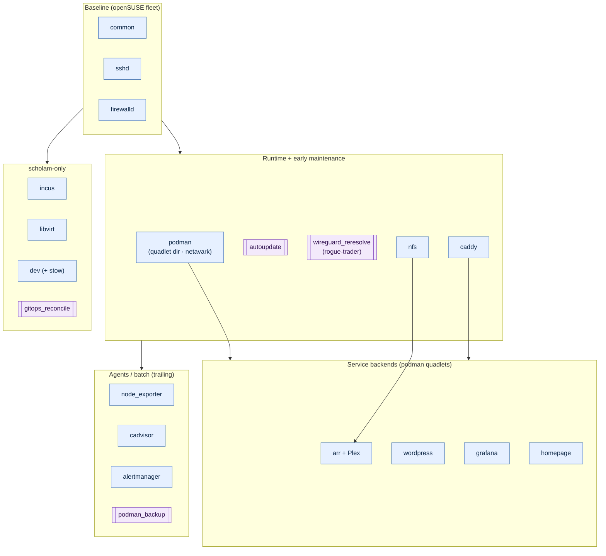
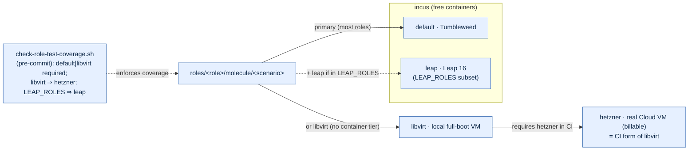

# Architecture

The stack at a glance. Four hosts, described declaratively by Ansible; container
workloads are podman quadlets behind a single caddy reverse proxy, except the NAS
(Docker Compose) and the exporters/tunnel (systemd). The cloud edge (Cloudflare,
Hetzner, GCP/Firebase) is OpenTofu, state in HCP. CI validates and deploys the
cloud + website; the Ansible fleet deploys itself via the `gitops_reconcile`
timer. Everything renders from source in this repo.

Diagrams are [Mermaid](https://mermaid.js.org) — they render inline on GitHub.

**Legend**

---

## 1. Fleet & network topology

`scholam` is the control host: it drives the fleet over SSH (over WireGuard for
the public VPS) and runs the self-applying `gitops_reconcile` timer. The NAS is
the NFS server (media + backups) and the monitoring hub.

---

## 2. `solar` — service stack (podman quadlets)

caddy is the only thing publishing ports (80/443). Every backend is portless on
`caddy.network`; internal apps import a wildcard vhost snippet, the public
`homepage` gets an apex site block. The **arr** apps and transmission share the
WireGuard sidecar's network namespace — a kill-switch: if the tunnel is down
(or unconfigured), their traffic has nowhere to go. Plex is host-networked for
discovery + hardware transcode. Exporters sit on the host network. The media
share mounts at `/data` for Plex, transmission, and the `*arr` importers
(radarr/sonarr/lidarr) plus beets; each app keeps its state in a per-app named
volume.

---

## 3. `rogue-trader` — public WordPress stack

The public VPS. caddy fronts a three-container WordPress stack (Apache/PHP +
MariaDB + Redis) on `caddy.network`; Cloudflare proxies the apex to it with
`ssl=strict`. SSH is closed on the public interface — it rides the WireGuard
tunnel (LAN source), which also carries NFS-backups and the metrics scrape.

---

## 4. Observability & alerting

Prometheus runs on the NAS (Docker Compose — the NAS has no podman). It scrapes
node/cAdvisor exporters across the fleet plus a co-located blackbox_exporter that
probes the public sites. Alerts route to Alertmanager on `solar`, then out to
Discord and a healthchecks.io dead-man's-switch. Grafana (on `solar`) reads
Prometheus back over the LAN. Batch jobs publish outcomes as node_exporter
**textfile** metrics.

> The NAS runs **no** node_exporter by design: its host metrics are DSM's domain,
> its free space is seen via the NFS mounts, and a total NAS outage trips the
> deadman (Prometheus dies with it, the heartbeat stops).

---

## 5. GitOps reconcile & backup / DR

Two independent loops. **GitOps** is anchored on `scholam` + `origin/main`: a
root timer pulls `origin/main` and applies the whole fleet — the sanctioned
unattended-apply path. **Backup** is anchored on the NAS: `podman_backup`
restic-snapshots every podman named volume to a per-host repo on the NAS, which a
Synology Hyper Backup task then replicates off-site.

> **DR** (`docs/disaster-recovery.md`): rebuild a host declaratively
> (`bootstrap` → `make apply PLAY=<host>`) then `podman-restore.sh` returns the
> volume state. `scholam`'s only state is the repo + `.vault_pass`; the NAS is
> the backup target, recovered via DSM + the off-site set.

---

## 6. Cloud edge & public request routing

One OpenTofu workspace manages three Cloudflare zones, the Hetzner firewall, and
the Firebase project — sharing one state so the Hetzner VM's live IP feeds the
Cloudflare apex record directly (origin IP never committed).

---

## 7. CI/CD & IaC pipeline

`VAULT_PASSWORD` is the only classic CI secret; everything GCP-facing is keyless
via Workload Identity Federation. Note the split: **CI deploys the cloud edge and
the website; it does not deploy the Ansible fleet** — that is `gitops_reconcile`'s
job (§5). Ansible CI only lints and molecule-tests.

---

## 8. Ansible role composition (per-host layering)

Roles compose in a set order per play: a baseline (account, SSH, firewall), then
the podman runtime and `autoupdate`, then caddy and the service backends; the
monitoring agents and `podman_backup` trail. `podman` must run first (it creates
the quadlet dir); `caddy` before any backend that drops a proxy snippet. Ordering
is enforced by the play — there are no `meta/dependencies`. The NAS runs none of
these (see matrix).

**Role → host matrix**

| Role | scholam | solar | rogue-trader | administratum |
|---|:--:|:--:|:--:|:--:|
| common · sshd · firewalld | ✅ | ✅ | ✅ | — |
| podman · autoupdate | ✅ | ✅ | ✅ | — |
| nfs | — | ✅ | ✅ | — |
| caddy | — | ✅ | ✅ | — |
| node_exporter | ✅ | ✅ | ✅ | — |
| cadvisor | — | ✅ | ✅ | — |
| podman_backup | — | ✅ | ✅ | — |
| arr · grafana · homepage · alertmanager | — | ✅ | — | — |
| wordpress · wireguard_reresolve | — | — | ✅ | — |
| incus · libvirt · dev · gitops_reconcile | ✅ | — | — | — |
| prometheus · blackbox_exporter · docker_prune | — | — | — | ✅ |

> The NAS (`administratum`) is not an openSUSE/podman host: it runs Docker
> Compose stacks unprivileged and gets none of the baseline roles. `stow`
> (dotfiles) and `motd` are omitted from the matrix — `stow` is pulled in by
> `common`/`dev` rather than assigned per host, and `motd` exists only as the
> molecule test exemplar.

---

## 9. Molecule test tiers

Each role ships molecule scenarios that CI runs against. Tiers share
role-agnostic create/destroy playbooks under `molecule/<tier>/`; a role keeps one
`converge`/`verify`, symlinked into its other scenarios. `motd` is the exemplar
carrying all four tiers.

